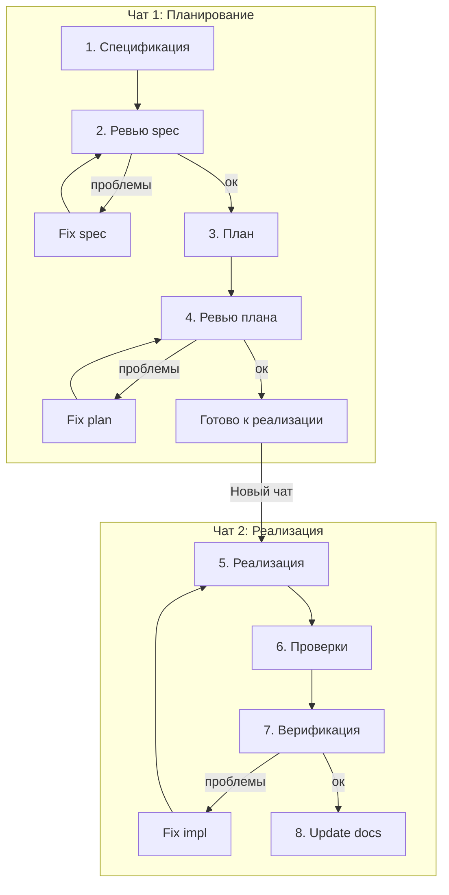

# Workflow: Краткая шпаргалка

---

## Диаграмма



---

## Последовательность шагов

### 1. Спецификация

**`/create-feature-spec`** с описанием фичи — вызывает subagent `spec-creator`, создаёт спецификацию по шаблону и сохраняет в `docs/features/{X.Y}-{slug}.md`.

*Рекомендуемая модель: Auto*

### 2. Ревью спецификации

**`/review-feature-spec`** с открытой спецификацией — вызывает subagent `spec-reviewer`, проверяет spec, подсвечивает проблемы и задаёт вопросы.

*Рекомендуемая модель: Claude 4.6 Sonnet* — обнаружение рисков и edge cases.

### 3. План реализации

**`/create-implementation-plan`** — вызывает subagent `plan-creator`, формирует план и сохраняет в `docs/plans/{X.Y}-{slug}.md`.

*Рекомендуемая модель: Auto*

### 4. Ревью плана

**`/review-implementation-plan`** — вызывает subagent `plan-reviewer`, читает план из `docs/plans/` или контекста, проверяет на архитектуру, безопасность и полноту, подсвечивает проблемы.

*Рекомендуемая модель: Auto*

### 5. Реализация *(начало чата 2)*

Выполняем шаги плана по очереди. Родительский агент по запросу «выполни шаг N» выполняет соответствующий шаг.

**Старт чата 2:** открой новый чат и передай spec + план:

```
Реализуй фичу X.Y по спецификации и плану.

@docs/features/{X.Y}-{slug}.md
@docs/plans/{X.Y}-{slug}.md

Действуй пошагово.
```

*Рекомендуемая модель: Auto*


### 6. Проверки

**`/run-verification-checks`** — запускает `pnpm test`, а также `pnpm lint` и `pnpm check-types` параллельно.

*Рекомендуемая модель: Gemini 3 Flash* — механический запуск команд.

### 7. Верификация реализации

**`/review-implementation`** — вызывает subagent `impl-verifier`, проверяет реализацию на соответствие спецификации и плану. Результаты проверок из шага 6 можно передать в контекст.

*Рекомендуемая модель: Claude 4.6 Sonnet* — финальная проверка перед коммитом.

### 8. Обновление документации

**`/update-docs`** — после завершения фичи обновляет spec и план, чтобы они соответствовали реализации; добавляет в `docs/roadmap.md` ссылку на описание фичи; дополняет разделы TODO и «После MVP» при необходимости; при необходимости вносит изменения в `docs/architecture.md`.

*Используемая модель: Gemini 3 Flash* — редактирование документации.
