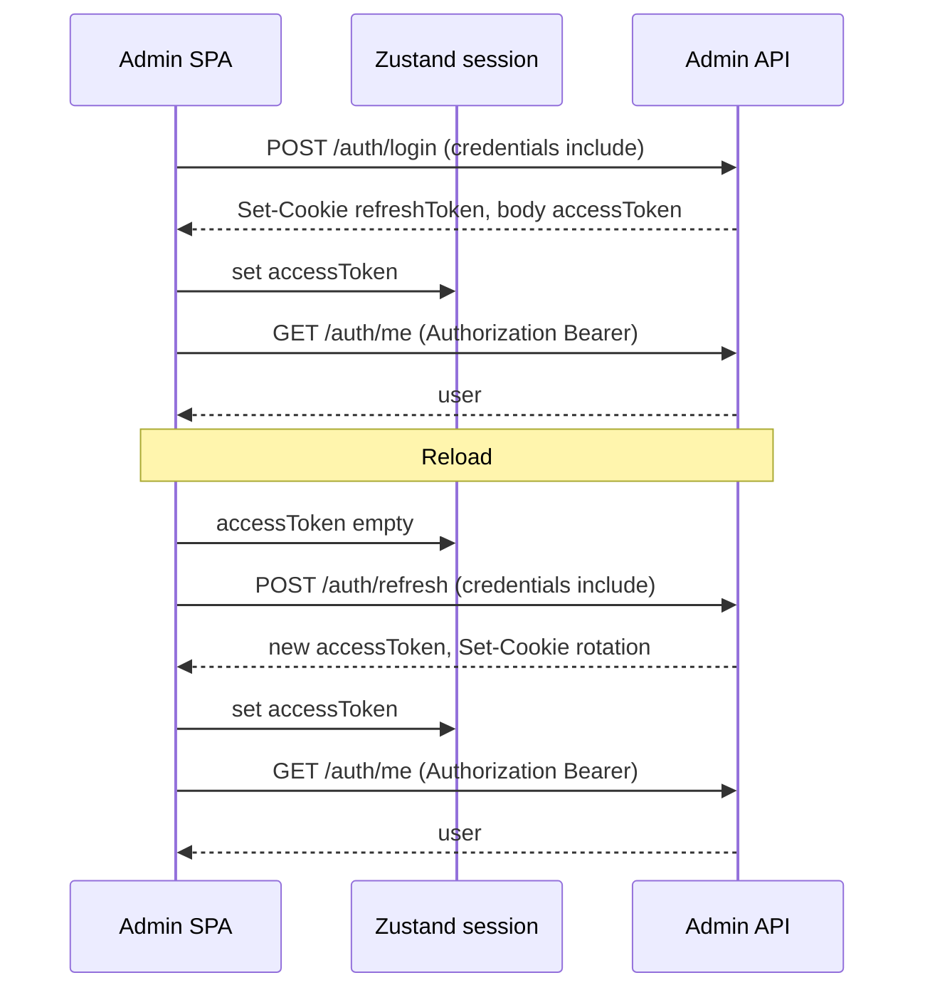

# Feature 3.1: Аутентификация Web Admin (вход и регистрация)

**Описание реализации**  
Реализация страниц входа и регистрации в Web Admin по макетам `design/admin.pen`, общих UI-примитивов в `packages/ui` на базе MUI, согласованных с `design/design-system.pen` и токенами `@repo/ui`, layout экранов auth **внутри `apps/admin`**, а также клиентской интеграции с Admin Auth API (Feature 1.1): хранение access token в памяти, refresh token в HttpOnly cookie, запросы с `credentials: 'include'`.

**Связанные документы:** [Architecture](../architecture.md), [Architecture: Frontend](../architecture-frontend.md), [Architecture: Web Admin](../architecture-admin.md), [Roadmap](../roadmap.md), [PRD](../prd.md), [Feature 1.1 — Admin Auth API](1.1-auth.md), [Feature 1.2 — бизнес](1.2-business.md)

---

## 1. Обзор

Фича закрывает первый пользовательский контакт с Web Admin: экраны **входа** и **регистрации** по email и паролю, единый визуальный каркас (шапка с брендом, центральная карточка формы, футер), переиспользуемые **примитивы** в `packages/ui` и корректную работу сессии на клиенте в соответствии с контрактом Feature 1.1 (без добавления новых backend-эндпоинтов).

### 1.1. Область реализации

| Область             | Применимо | Примечание |
| ------------------- | --------- | ---------- |
| Backend (API)       | ☐         | Новые эндпоинты не вводятся; используется API из [Feature 1.1](1.1-auth.md) |
| Frontend (Admin)    | ☑         | Vite + React, FSD, React Query, Zustand, i18next, `@api`, `@repo/ui`, layout auth-экранов |
| Frontend (Mini App) | ☐         | — |
| База данных         | ☐         | — |
| Пакет UI            | ☑         | `packages/ui` — только MUI-обёртки **Button**, **Input**, **Checkbox** по дизайн-системе (без layout auth) |

### 1.2. Контекст

| Сущность / понятие | Назначение |
| ------------------ | ---------- |
| **AdminUser** | Пользователь Web Admin; создаётся при регистрации, используется при входе (см. 1.1) |
| **accessToken** | JWT типа `access`, передаётся в `Authorization: Bearer …`, хранится только в памяти клиента |
| **refreshToken** | JWT типа `refresh`, устанавливается сервером в HttpOnly cookie `refreshToken` (Path `/api/v1/admin/auth`); из JS недоступен |
| **Сессия (клиент)** | Согласованное состояние: валидный access в памяти + данные пользователя после успешного `GET /me` в рамках текущего «сеанса загрузки» |
| **OpenAPI client (`@api`)** | Единая точка HTTP-вызовов из админки; запросы к auth выполняются с учётом cookie и заголовка Authorization |

---

## 2. Пользовательские сценарии

| ID   | Сценарий | Актор |
| ---- | -------- | ----- |
| UC-1 | Открыть страницу входа, ввести почту и пароль, отправить форму и попасть в защищённую зону приложения при успешном ответе API | Admin |
| UC-2 | Перейти со страницы входа на страницу регистрации по элементу переключения («Нет аккаунта? Зарегистрироваться») | Admin |
| UC-3 | На странице регистрации ввести почту, пароль, подтверждение пароля, отметить согласие с офертой/политикой, отправить форму и оказаться в приложении с активной сессией | Admin |
| UC-4 | Перейти со страницы регистрации на страницу входа («Уже есть аккаунт? Войти») | Admin |
| UC-5 | После успешного входа или регистрации при последующих запросах к API клиент передаёт access token и при необходимости cookie для refresh | Admin |
| UC-6 | Перезагрузить страницу приложения: при наличии валидной refresh-cookie сессия восстанавливается через `POST /refresh`, затем загружается профиль через `GET /me`, без повторного ввода пароля | Admin |
| UC-7 | На экране входа видеть элемент «Не помню пароль» как в макете; **в рамках 3.1** восстановление пароля не реализуется — переход и вызовы API не выполняются (заглушка) | Admin |
| UC-8 | Будучи уже аутентифицированным, открыть `/login` или `/register` — выполняется редирект на **главную** защищённого приложения | Admin |
| UC-9 | Перейти на защищённый маршрут без сессии — редирект на `/login` с сохранением целевого пути для возврата после успешного входа (**returnUrl**, только внутренние пути) | Admin |

---

## 3. Критерии приёмки

- [ ] Реализованы маршруты `/login` и `/register` (константы в `shared`); вёрстка и иерархия блоков соответствуют макету в `design/admin.pen` (шапка с логотипом и брендом, по центру карточка формы, внизу футер с копирайтом). **Layout auth-экрана** реализован в `apps/admin` (например `widgets`), а не в `packages/ui`.
- [ ] Тексты интерфейса соответствуют макету: вход — заголовок «Вход», поля «Почта» и «Пароль», элемент «Не помню пароль» (без функции восстановления в 3.1), кнопка «Войти», переключение на регистрацию; регистрация — «Регистрация», поля почта/пароль/повтор пароля, чекбокс согласия (тексты «оферта» и «политика» — через i18n, **визуально как ссылки, без реального перехода** — см. §7), кнопка «Зарегистрироваться», переключение на вход.
- [ ] В `packages/ui` на базе MUI добавлены и экспортированы: **Button** (варианты Primary, Secondary, Action с иконкой, Ghost по `design/design-system.pen`); **Input** — обёртка/стилизация поля ввода (например `TextField`) с состояниями default, error, disabled; высота поля ~44px, скругление 8px, обводка из токенов; **Checkbox** в стиле дизайн-системы. Стилизация через **MUI theme + tokens** `@repo/ui`; использование Tailwind внутри `packages/ui` **не является** обязательным (в apps предпочтительно Tailwind по архитектуре).
- [ ] Цвета, типографика и отступы согласованы с `design/design-system.pen` и `variables.css` / `tokens.ts` / MUI `theme` в `@repo/ui`; в коде нет произвольных hex без привязки к токенам/теме.
- [ ] **Холодный старт и порядок запросов** (согласовано с [Feature 1.1](1.1-auth.md)): пока идёт проверка сессии, не показывать преждевременно «чистый» login без завершения попытки refresh; при отсутствии access в памяти — `POST /refresh` с `credentials: 'include'`; при успехе — сохранить access, **затем обязательно `GET /me`** до того, как считать пользователя вошедшим и выполнять остальные защищённые запросы; при неуспехе refresh — состояние «гость», редирект на `/login` для защищённых маршрутов.
- [ ] После **login** / **register** / успешного **refresh:** сохранить `accessToken`, **затем выполнить `GET /me`** (побочные эффекты 1.1, в т.ч. бизнес при первом входе).
- [ ] **401 на защищённом запросе** при истечении access: один координируемый вызов `POST /refresh` (**single-flight** — не более одного refresh одновременно); при успехе — повторить **исходный** запрос один раз; при неуспехе refresh — сброс сессии на клиенте и редирект на `/login` (с сохранением returnUrl при необходимости).
- [ ] `POST /login` и `POST /register` через `@api` с `credentials: 'include'`; `POST /logout` доступен из инфраструктуры сессии; очистка клиента после успеха.
- [ ] Ошибки API отображаются осмысленно (маппинг кодов 1.1 на i18n), в т.ч. **`403 ACCOUNT_LOCKED`**, коды неуспешного **refresh** (`REFRESH_TOKEN_EXPIRED`, `REFRESH_TOKEN_REVOKED`, `UNAUTHORIZED` — см. 1.1); валидация форм на клиенте до отправки.
- [ ] **Сеть / недоступность API:** отличать ответ с телом ошибки от сетевого сбоя (нет ответа, таймаут); показывать понятное сообщение; кнопки submit — состояние loading/disabled по ходу мутации; при необходимости дублировать критичные ошибки через notistack согласно [architecture-frontend.md](../architecture-frontend.md).
- [ ] Все пользовательские строки — i18next; ключи в духе `auth.login.*`, `auth.register.*`.
- [ ] Запросы — TanStack React Query (мутации login/register, логика refresh/me согласно §4).
- [ ] Защищённые маршруты без сессии → редирект на `/login` с **безопасным** `returnUrl` (§4.4); после входа — редирект на главную или на проверенный `returnUrl`.
- [ ] Уже аутентифицированный пользователь на `/login` или `/register` → **редирект на главную** защищённого приложения (`/` или единый маршрут «home», зафиксировать в константах).
- [ ] **Доступность (a11y):** у полей связь label ↔ input (`htmlFor` / `id`), ошибки и `helperText` доступны вспомогательным технологиям; фокус при ошибке сабмита — по соглашению (первое невалидное поле); клавиатурная навигация по форме и чекбоксу.
- [ ] Структура `apps/admin` — FSD; импорты только вниз по слоям; публичные API слайсов через `index.ts`.

---

## 4. Технический дизайн

### 4.1. Размещение по слоям FSD (`apps/admin`)

| Слой      | Назначение в рамках фичи |
| --------- | ------------------------ |
| **app**   | Провайдеры (QueryClient, i18n, MUI ThemeProvider из `@repo/ui`), **инициализация сессии** (§4.2), HTTP-клиент `@api` с Bearer из store и **перехватом 401** (§4.2), глобальный индикатор «проверка сессии» при cold start |
| **pages** | `LoginPage`, `RegisterPage` — композиция **widget layout auth**, features |
| **widgets** | **Auth screen layout («холст»):** шапка (логотип + бренд), main (центрированный контент), footer (копирайт); общий для login/register |
| **features** | `auth/login`, `auth/register` — формы, мутации React Query, навигация, обработка `returnUrl` |
| **entities** | При необходимости — сессия / пользователь (типы, маппинг `/me`) |
| **shared** | Константы маршрутов (`ROUTE_LOGIN`, `ROUTE_REGISTER`, `ROUTE_HOME`), утилита **нормализации и проверки `returnUrl`**, валидация форм, хуки |

Импорты: `app → pages → widgets → features → entities → shared`.

### 4.2. Клиент API, токены, refresh и 401

- Все запросы — через `client` из `@api` с возможностью подстановки `Authorization` и `credentials: 'include'` для auth.
- **accessToken** — Zustand (или эквивалент); **не** `localStorage` / `sessionStorage`.
- **refreshToken** — только cookie; обрабатывать новый `Set-Cookie` при rotation (1.1).

**Канонический порядок после появления access (login / register / успешный refresh):**

1. Сохранить `accessToken` в store.  
2. Выполнить **`GET /api/v1/admin/auth/me`** прежде чем считать bootstrap завершённым и до прочих защищённых запросов приложения.

**Cold start (перезагрузка SPA):**

1. Нет access в памяти → попытка `POST /refresh` с `credentials: 'include'`.  
2. Успех → сохранить access → **`GET /me`**.  
3. Неуспех → гость; защищённые маршруты ведут на `/login`.

**401 на защищённом запросе** (истёкший access, но сессия могла бы продлиться):

- Если это не сам запрос к `/refresh`: запустить **один** экземпляр refresh (**single-flight**: параллельные 401 ждут тот же Promise).  
- Успех refresh → обновить access → **повторить исходный запрос один раз**.  
- Неуспех → очистить сессию, редирект на `/login` (при необходимости с `returnUrl`).

**Несколько вкладок:** допускается упрощённый MVP-подход — гонки решаются single-flight на уровне вкладки; при провале refresh из-за rotation пользователь перелогинивается. При необходимости позже усилить (BroadcastChannel и т.д.) — вне минимального скоупа 3.1, если не потребуется явно.

### 4.3. Пакет `packages/ui`

- Только **Button**, **Input**, **Checkbox** на базе MUI с переопределением через theme/tokens `@repo/ui`.
- **Button:** Primary, Secondary, Action (иконка + текст), Ghost; hover / disabled / loading.
- **Input:** ~44px высота, radius 8px, default / error / disabled; label, helperText, error message.
- **Checkbox:** по дизайн-системе.

### 4.4. Роутинг и returnUrl

- `createBrowserRouter`, lazy-страницы — см. [architecture-admin.md](../architecture-admin.md).
- Публичные маршруты: **`/login`**, **`/register`** (константы в `shared`).
- **Главная после входа и при редиректе «уже залогинен»:** один защищённый маршрут по умолчанию (например `/`) — зафиксировать как `ROUTE_HOME`.
- **returnUrl:** query-параметр при редиректе гостя на логин, например `/login?returnUrl=%2Fsettings`.  
  **Правила безопасности:** принимать только **внутренние** пути текущего SPA: начинается с `/`, не начинается с `//`, не содержит схемы (`http:`, `https:`), не ведёт на `/login` и `/register` (чтобы избежать петель). После успешного login/register — редирект на нормализованный `returnUrl` или на `ROUTE_HOME`, если параметр отсутствует или невалиден.

### 4.5. Обработка ошибок и уведомления

- Формат API: `{ status: 'error', error: { code, message } }` — см. [architecture-frontend.md](../architecture-frontend.md).
- Мутации login/register — ошибки у полей и/или **notistack**.
- **Logout:** при ответе 401 без валидной сессии на сервере — привести клиент к состоянию «гость» и не зациклить повторные вызовы.
- Глобальный **`onError` в React Query** (где принято в проекте) — для сетевых сбоев и необработанных ошибок.

---

## 5. Схема базы данных

> Изменения схемы БД в рамках фичи **3.1 не выполняются**. Учётные данные и токены на сервере описаны в [Feature 1.1](1.1-auth.md).

---

## 6. API эндпоинты

> Новых backend-маршрутов не добавляется. Ниже — **потребление** существующего Admin Auth API ([Feature 1.1](1.1-auth.md)).

Base path: `/api/v1/admin/auth`

| Метод | Путь        | Использование на фронте |
| ----- | ----------- | ------------------------- |
| POST  | `/login`    | Вход; `credentials: 'include'` |
| POST  | `/register` | Регистрация; `credentials: 'include'` |
| POST  | `/refresh`  | Cold start, 401 interceptor |
| POST  | `/logout`   | Выход |
| GET   | `/me`       | После появления access; обязателен в bootstrap |

### 6.1. Коды ошибок (наследие 1.1)

| Код / контекст | Когда |
| -------------- | ----- |
| `400 VALIDATION_FAILED` | Невалидное тело |
| `401 INVALID_CREDENTIALS` | Неверный логин/пароль |
| `403 ACCOUNT_LOCKED` | Аккаунт заблокирован — отдельное сообщение в UI |
| `409 EMAIL_ALREADY_EXISTS` | Email занят |
| `429 RATE_LIMIT_EXCEEDED` | Лимит запросов |
| `401 REFRESH_TOKEN_EXPIRED`, `401 REFRESH_TOKEN_REVOKED`, `401 UNAUTHORIZED` | Неуспешный refresh — сброс сессии, редирект на login |

Детали тел — в [1.1-auth.md](1.1-auth.md).

### 6.2. CORS и cookie

- Согласовать origin админки и cookie с бэкендом — раздел 9 в 1.1. Фронт: `credentials: 'include'` для auth-запросов.

---

## 7. UI / Frontend

| Маршрут     | Описание |
| ----------- | -------- |
| `/login`    | Вход: почта, пароль, **«Не помню пароль»** (визуал как в макете; **без** маршрута forgot, **без** вызовов forgot/reset API), «Войти», ссылка на регистрацию |
| `/register` | Регистрация: почта, пароль, повтор, чекбокс согласия, кнопка, ссылка на вход |

**Оферта и политика в чекбоксе:** в интерфейсе — два фрагмента текста/элемента, оформленных как ссылки (стили дизайн-системы), тексты из i18n. **Поведение в 3.1:** `preventDefault` / без навигации и без реального URL (заглушка до появления целевых страниц или внешних ссылок в продукте).

**Компоненты:** из `@repo/ui` — Button, Input, Checkbox. В **apps/admin** — widget **Auth screen layout**, страницы и фичи форм.

**Состояние:** Zustand (сессия), React Query (мутации и bootstrap).

| Сценарий | Поведение |
| -------- | --------- |
| Успешный login/register | access → `GET /me` → редирект на `returnUrl` (если валиден) или `ROUTE_HOME` |
| Неверные учётные данные | Сообщение (401 / код) |
| `ACCOUNT_LOCKED` | Отдельное сообщение пользователю |
| Rate limit | Сообщение о лимите |
| Пароли не совпадают | Блокировать submit, ошибка у поля подтверждения |
| Чекбокс не отмечен | Блокировать submit |
| Уже есть сессия на `/login` или `/register` | Редирект на `ROUTE_HOME` |

---

## 8. DTO и валидация

> Клиентская валидация — не слабее разумного подмножества серверной (1.1).

| Поле            | Тип     | Required (UI)       | Валидация клиента |
| --------------- | ------- | ------------------- | ----------------- |
| email           | string  | ☑                   | Формат email, max 254 |
| password        | string  | ☑                   | Как в 1.1 |
| passwordConfirm | string  | ☑ (только register) | Совпадение с `password` |
| consent         | boolean | ☑ (register)        | `true` для отправки |

`firstName` / `lastName` на форме **не показывать**; тело `POST /register` — как минимум `email` и `password` (см. [1.1-auth.md](1.1-auth.md)).

---

## 9. Безопасность и доступ

- **accessToken** — только память процесса.
- **refreshToken** — HttpOnly cookie; не логировать.
- Auth-запросы с cookie — `credentials: 'include'`.
- После logout — очистить access в store.
- **returnUrl** — только внутренние пути SPA; отклонять внешние и `//` (open redirect).
- Не показывать сырой токен; не логировать пароли.

---

## 10. Тестовые сценарии

| ID    | Сценарий | Ожидаемый результат |
| ----- | -------- | ------------------- |
| TC-1  | Успешный вход | Редирект home или returnUrl, access в store, `GET /me` успешен |
| TC-2  | Неверный пароль | Ошибка, сессия не установлена |
| TC-3  | Регистрация нового пользователя | Как после login, `GET /me` выполнен |
| TC-4  | Регистрация: email занят | Сообщение конфликта |
| TC-5  | Регистрация без чекбокса | Submit заблокирован |
| TC-6  | Разные пароли | Ошибка валидации на клиенте |
| TC-7  | Перезагрузка при валидной cookie | refresh → `GET /me` → пользователь в приложении |
| TC-8  | Logout | Сессия сброшена, защищённые маршруты недоступны |
| TC-9  | Переход login ↔ register | Корректные маршруты, изоляция форм |
| TC-10 | «Не помню пароль» | Элемент отображается; **нет** навигации и **нет** вызова forgot/reset API |
| TC-11 | Залогиненный открывает `/login` | Редирект на `ROUTE_HOME` |
| TC-12 | Гость открывает защищённый маршрут | Редирект на `/login` с валидным `returnUrl` |
| TC-13 | `returnUrl` с внешним URL или `//` | Игнор, после входа — `ROUTE_HOME` |
| TC-14 | Истёкший access, успешный refresh | Запрос повторяется, данные загружаются |
| TC-15 | `ACCOUNT_LOCKED` | Показано отдельное сообщение |

---

## 11. Конфигурация и зависимости

**Env (админка, Vite):**

- **`VITE_API_URL`** — origin Backend API (например `http://localhost:3000`); должен быть согласован с CORS и cookie на API. Типы — в `vite-env.d.ts`. См. `apps/admin/.env.example`.

**Зависимости:**

- [Feature 1.1](1.1-auth.md) — контракт Auth API.
- `apps/admin`, `packages/ui`, `@repo/ui`, `@api`, React Query, Zustand, i18next, MUI (peer в admin).

**Генерация API:** `pnpm --filter admin api:generate` при изменении OpenAPI.

---

## 12. Связь с другими фичами

- **[Feature 1.1](1.1-auth.md)** — эндпоинты, токены, cookie, коды ошибок, обязательность логики `/me` после получения access.
- **[Feature 1.2](1.2-business.md)** — побочный эффект первого `/me` / бизнеса.
- **[Roadmap — Фаза 3](../roadmap.md)** — 3.1 первый этап Web Admin.

**Вне скоупа 3.1:** восстановление пароля (forgot/reset), OAuth, реальные URL оферты/политики (пока заглушки в UI).

---

## 13. Миграции

Миграции БД **не требуются**.
